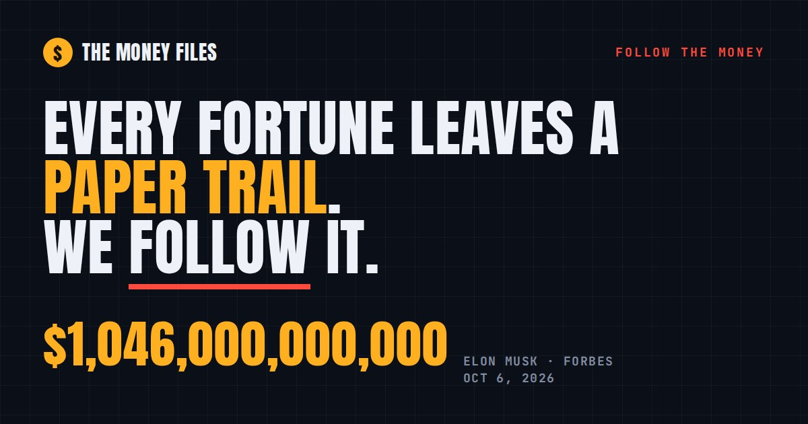

# The Money Files

Interactive, fully sourced "follow the money" maps from the Follow the Money video series. Each file is one family: who's who, what they own, which of their companies you can buy stock in, and the money on the public record, with every number linked to its source.

**Live site:** https://destinjones.github.io/the-money-files/

## The files

22 families so far:

| File | Family | World | What's in it |
|---|---|---|---|
| #006 | [The Musk family](https://destinjones.github.io/the-money-files/musk/) | Tech | The first trillionaire. SpaceX, Tesla, the brothers, the cousins and 14 kids. |
| #007 | [The Bezos family](https://destinjones.github.io/the-money-files/bezos/) | Tech | Amazon, Blue Origin, The Washington Post, and about $700 million in homes. |
| #008 | [The Zuckerberg family](https://destinjones.github.io/the-money-files/zuckerberg/) | Tech | Meta, a 99% giving pledge, three sisters and a $170 million Miami compound. |
| #009 | [The Ellison family](https://destinjones.github.io/the-money-files/ellison/) | Tech | Oracle, 98% of a Hawaiian island, and a son who runs Paramount. |
| #010 | [The Gates family](https://destinjones.github.io/the-money-files/gates/) | Tech | Microsoft, a foundation set to close in 2045, and a family office called Cascade. |
| #011 | [The Huang family](https://destinjones.github.io/the-money-files/huang/) | Tech | Nvidia, the AI boom, and two children who work at the company. |
| #012 | [The Brin family](https://destinjones.github.io/the-money-files/brin/) | Tech | Google, two ex-wives with ventures of their own, and an airship company. |
| #013 | [The Buffett family](https://destinjones.github.io/the-money-files/buffett/) | Business | Berkshire Hathaway, the Omaha house he bought in 1958, and billions given away. |
| #014 | [The Walton family](https://destinjones.github.io/the-money-files/walton/) | Business | America’s richest family: about 44% of Walmart, the Broncos and four billionaires. |
| #015 | [The Arnault family](https://destinjones.github.io/the-money-files/arnault/) | Business | LVMH, Dior, Paris FC and five children running the brands. |
| #016 | [The Murdoch family](https://destinjones.github.io/the-money-files/murdoch/) | Business | Fox, News Corp and the trust fight that left Lachlan in control. |
| #017 | [The Kardashian-Jenner family](https://destinjones.github.io/the-money-files/kardashian/) | Entertainment | SKIMS, Kylie Cosmetics, Good American: the TV family’s businesses, mapped. |
| #018 | [The Swift family](https://destinjones.github.io/the-money-files/swift/) | Entertainment | The masters she bought back, the first $2 billion tour, and a new family. |
| #019 | [The Fenty family](https://destinjones.github.io/the-money-files/rihanna/) | Entertainment | Fenty Beauty, Savage X Fenty and the talks over LVMH’s half. |
| #020 | [The Carter family](https://destinjones.github.io/the-money-files/carter/) | Entertainment | Jay-Z and Beyoncé: Roc Nation, champagne, cognac, Tidal and two billionaires. |
| #021 | [The Winfrey family](https://destinjones.github.io/the-money-files/winfrey/) | Entertainment | Harpo, OWN, WeightWatchers and land in Montecito and Maui. |
| #022 | [The Donaldson family](https://destinjones.github.io/the-money-files/mrbeast/) | Entertainment | MrBeast’s Beast Industries, Feastables, Beast Games and a $5 billion valuation. |
| #023 | [The James family](https://destinjones.github.io/the-money-files/james/) | Sports | The first active NBA billionaire: Nike for life, Fenway Sports Group and Beats. |
| #024 | [The Jordan family](https://destinjones.github.io/the-money-files/jordan/) | Sports | The Nike deal, the Hornets sale, a NASCAR team and a tequila brand. |
| #025 | [The Ronaldo family](https://destinjones.github.io/the-money-files/ronaldo/) | Sports | Al-Nassr, Nike, CR7 hotels and football’s first billionaire. |
| #026 | [The Trump family](https://destinjones.github.io/the-money-files/trump/) | Politics | Trump Media, World Liberty, the $TRUMP coin, Mar-a-Lago and who runs what. |
| #027 | [The Pelosi family](https://destinjones.github.io/the-money-files/pelosi/) | Politics | Her House disclosures, Paul Pelosi’s reported trades, and two Baltimore mayors. |

## The main page

- **The leaderboard.** The person at the center of each file, ranked by their Forbes or Bloomberg estimate, with bars drawn to scale. Pick anyone on the board to measure everyone else in their fortune, for example how many LeBron James fortunes fit in Elon Musk's.
- **The files.** Every family as a card. Filter by world (tech, business, entertainment, sports, politics) or sort by fortune or file number.
- **The case files.** The short videos that trace everyday brands back to who owns them, each with its sources.

## What's on each family page

- **The family.** A family tree. Tap anyone to open their file: what they own and run, their net worth (where Forbes or Bloomberg publish one), money on the public record, facts and sources. Deep links work too, for example `/musk/#kimbal` or `/buffett/#howard`.
- **Can you buy it?** Which family companies trade publicly, with the ticker, and which are private, sold or not owned by the family.
- **Where the money is.** What the fortune is made of, and a money ladder drawn to scale.
- **The homes.** Where reported: what they paid, what they sold for, neighborhood level only.
- **On the record.** SEC filings, court records, tax returns, foundation filings and reporting in one ledger.
- **The money trail.** A timeline from the start to today's fortune.
- **Perspective.** Type an income and see how long it would take to earn what they have.
- **More files.** The next files to read, at the bottom of every page.

Sections a family has no public data for are left out rather than guessed.

## Rules this project follows

- Every fact links to its source. All sources are listed in [SOURCES.md](SOURCES.md).
- Data is as of **Oct 6, 2026**. Net worth figures are estimates and change every trading day.
- No street addresses. Children appear by first name only, never in photos, and not at all when their names aren't public. Private relatives are left out.
- Photos are of adults who are public figures, from Wikimedia Commons under the licenses credited on each page.
- No gossip or unproven allegations. Nothing here is investment advice.

## How it's built

| Path | What it is |
|---|---|
| `data/<family>-family.json` | Every person, company, number and source for one family. Edit these to update the facts. |
| `src/hub.html` | The main page. |
| `src/body.html`, `src/style.css`, `src/app.js` | The family page template, styles and script. |
| `tools/build.py` | Builds `index.html`, each `<family>/index.html` and `SOURCES.md`. |
| `tools/validate.py` | Checks a data file before it goes on the site: required fields, sources, label lengths, no street addresses. |
| `tools/FAMILY_SPEC.md` | The data format, for writing a new family file. |
| `assets/` | Case-file covers and the link-preview images. |

To add a family: write `data/<slug>-family.json` following `tools/FAMILY_SPEC.md`, run `python3 tools/validate.py data/<slug>-family.json`, add one line to `FAMILIES` in `tools/build.py`, then run `python3 tools/build.py`.

To update the site, edit the data or `src/` files, run `python3 tools/build.py`, then commit and push. GitHub Pages serves `index.html` from the `main` branch.

## Corrections

Spotted something wrong? [Open an issue](https://github.com/destinjones/the-money-files/issues) with the claim and a source.
