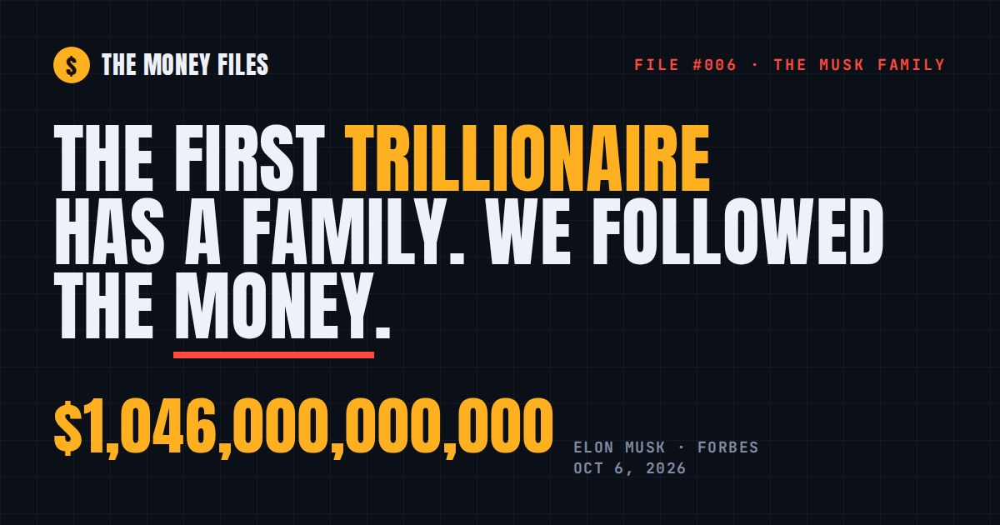

# The Money Files

Interactive, fully sourced "follow the money" maps from the Follow the Money video series. The first one is **File #006: the Musk family**.

**Live site:** https://destinjones.github.io/the-money-files/

## What's on the page

- **The family.** A tree of Elon Musk's family. Tap anyone to open their file: what they own and run, their net worth (where Forbes or Bloomberg publish one), money on the public record, wow facts and sources. Deep links work too, for example `#kimbal`.
- **Can you buy it?** Which family companies trade publicly (Tesla `TSLA`, SpaceX `SPCX`) and which are private, sold or have no Musk stake.
- **Where the trillion lives.** Elon's biggest holdings and his climb from $500 billion to $1 trillion.
- **The homes.** Seven California homes bought for about $102M, all sold by late 2021 for about $127.9M, then a roughly $50K rental at Starbase.
- **On the record.** SEC filings, FEC totals, the Musk Foundation's tax return and court records in one ledger.
- **The money trail.** From Zip2 in 1995 to the first trillion in 2026.
- **Perspective.** Type an income and see how long it would take to earn what Elon has.
- **The case files.** Cases #001 to #005 and the Master File from the video series, with their sources.

## Rules this project follows

- Every fact links to its source. All 129 sources are listed in [SOURCES.md](SOURCES.md).
- Data is as of **Oct 6, 2026**. Net worth figures are estimates and change every trading day.
- No street addresses. Children appear by name only, with no photos. Private relatives are left out.
- Photos are of adults who are public figures, from Wikimedia Commons under the licenses credited in [SOURCES.md](SOURCES.md).
- Nothing here is investment advice.

## How it's built

| Path | What it is |
|---|---|
| `data/musk-family.json` | Every person, company, number and source. Edit this to update the facts. |
| `src/body.html`, `src/style.css`, `src/app.js` | The page markup, styles and script. |
| `tools/build.py` | Builds `index.html` and `SOURCES.md` from the files above. |
| `assets/` | Case-file covers and the link-preview image. |

To update the site, edit the data or `src/` files, run `python3 tools/build.py`, then commit and push. GitHub Pages serves `index.html` from the `main` branch.

## Corrections

Spotted something wrong? [Open an issue](https://github.com/destinjones/the-money-files/issues) with the claim and a source.
